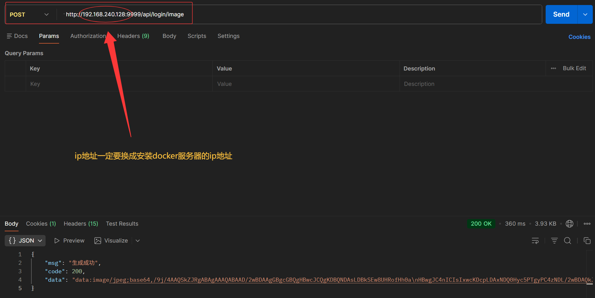
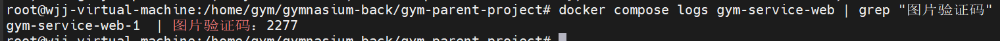
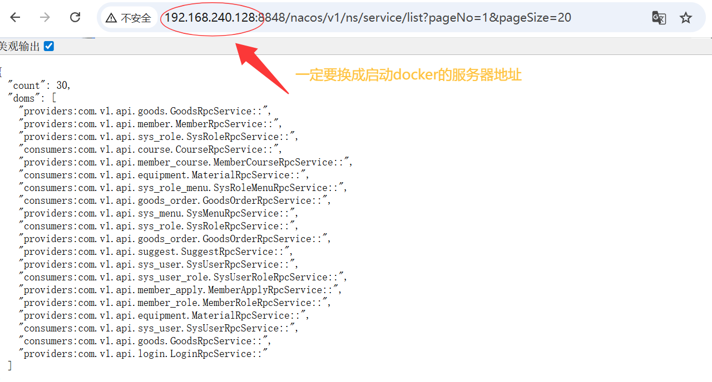
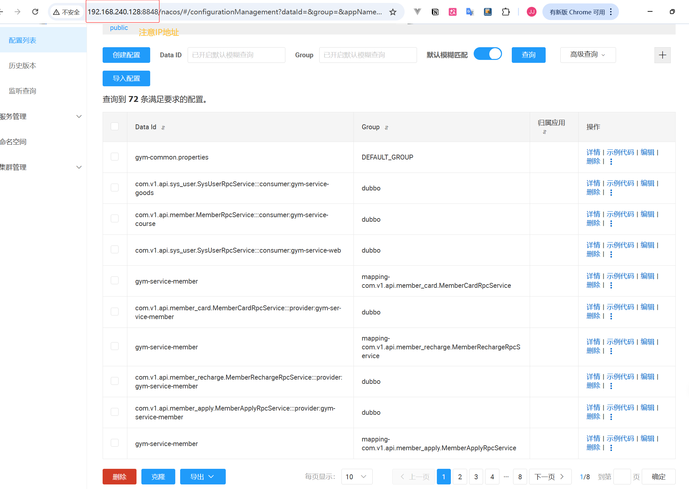
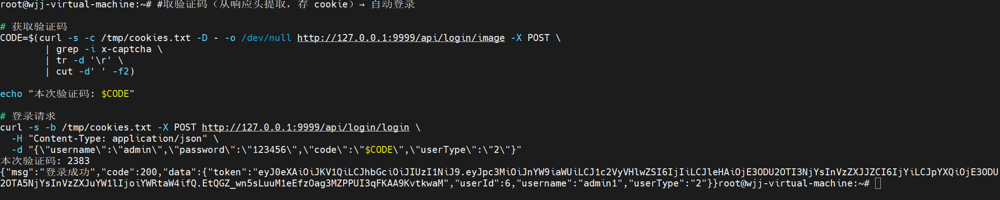

# Docker本地部署(host网络模式)

## Step 0：前置检查（在 VM 上）

```bash
# 确认工具
git --version && docker --version && docker compose version

# 确认端口没被占用（若 VM 自带 MySQL 会冲突，需停掉）
ss -tlnp 2>/dev/null | grep -E "3306|8848|9000|9001|808[1-5]|9999|2088[0-5]" || echo "端口全部空闲"
```

## Step 1：克隆代码

```bash
git clone https://github.com/Wjj-3468272717/gymnasium-back.git
cd gymnasium-back/gym-parent-project
```

## Step 2：Docker 内编译 jar（一次性，约 10–15 分钟）

  VM 没有 Maven/JDK，用 dockerized Maven 编译整个项目：

```bash
docker run --rm \
-v "$(pwd)":/app \
-v maven-repo:/root/.m2 \
-w /app \
maven:3.6.3-openjdk-8 \
mvn clean install -DskipTests

# ▎ maven-repo 命名卷缓存依赖，下次重新编译只需几分钟。

#验证产物：
ls -lh gym-service-*/target/*-exec.jar gym-service-web/target/gym-service-web-1.0-SNAPSHOT.jar
```

提前拉取需要的镜像

```bash
docker pull eclipse-temurin:8-jre

docker pull mysql:8.0

docker pull minio/minio

docker pull nacos-registry.cn-hangzhou.cr.aliyuncs.com/nacos/nacos-server:v2.2.3
#把 Nacos 打 tag 成 compose 需要的名字
docker tag nacos-registry.cn-hangzhou.cr.aliyuncs.com/nacos/nacos-server:v2.2.3 nacos/nacos-server:v1.4.2
docker images | grep nacos
```

## Step 3：构建镜像

```bash
 docker compose build
```

##   Step 4：启动全部服务

```bash
  docker compose up -d
```

>   启动顺序是自动编排的：MySQL → Nacos → nacos-init（上传配置）→ 5 个 Provider + Web。等 1 分钟左右。
>

##   Step 5：查看状态

```bash
 docker compose ps
```

>   预期结果：mysql、nacos、minio、gym-service-user/member/course/goods/home/web 全部 Up；nacos-init 为 Exited (0)（一次性任务，正常）。
>

##   Step 6：验证

```bash
#看配置是否成功加载

docker compose logs gym-service-user | grep NacosConfig
```

> 预期: [NacosConfig] Loaded 8 properties from gym-common.properties
>
> 验证码登录接口（返回 JSON）
>
>   curl -s http://127.0.0.1:9999/api/login/image -X POST
>
> 
>
> 登录接口（验证码在 web 日志里）
>
>   docker compose logs gym-service-web | grep "图片验证码"
>
> 
>
> Nacos 控制台（浏览器打开 http://<VM_IP>:8848/nacos，应有 6 个 Dubbo 服务）
>
>   curl -s "http://127.0.0.1:8848/nacos/v1/ns/service/list?pageNo=1&pageSize=20"
>
> 
>
> nacos服务器ui界面 http://127.0.0.1:8848/nacos/，用户名和密码都是nacos
>
> 
>
> 验证登录功能
>
> ```bash
> #取验证码（从响应头提取，存 cookie）→ 自动登录
> 
> # 获取验证码
> CODE=$(curl -s -c /tmp/cookies.txt -D - -o /dev/null http://127.0.0.1:9999/api/login/image -X POST \
>         | grep -i x-captcha \
>         | tr -d '\r' \
>         | cut -d' ' -f2)
> 
> echo "本次验证码: $CODE"
> 
> # 登录请求
> curl -s -b /tmp/cookies.txt -X POST http://127.0.0.1:9999/api/login/login \
>   -H "Content-Type: application/json" \
>   -d "{\"username\":\"admin\",\"password\":\"123456\",\"code\":\"$CODE\",\"userType\":\"2\"}"
> ```
>
> 
>
> ```tex
>  ✅ 部署完成确认
>      
>   这次成功的登录验证了整条完整链路：
>      
>   前端请求 → gym-service-web(:9999)
>            → Dubbo RPC（经 Nacos 发现服务）
>            → gym-service-user(:20881)
>            → MySQL（查到 admin 用户）
>            → BCrypt 校验密码
>            → 签发 JWT token ✅
> ```


