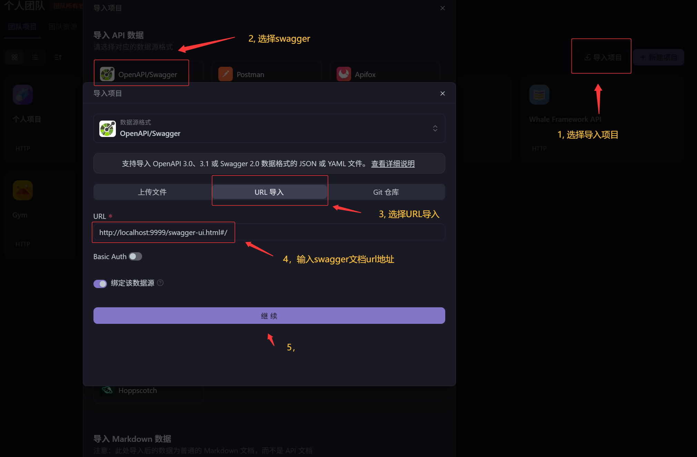

# 帕梅拉酷我健身在线管理系统

基于 Spring Boot + Dubbo 分布式架构的健身房管理系统后端，提供会员管理、课程管理、商品订单、器材管理、权限控制等核心功能。

---


## 项目介绍

本项目从 Spring Boot 单体架构演进为 **Dubbo + Nacos 微服务分布式架构**，实现了服务拆分、远程调用、配置中心统一管理。系统面向健身房日常运营场景，支持管理员（员工）、教练、会员三种角色，涵盖用户认证、权限管理、会员办卡充值、课程报名、商品下单、器材管理、失物招领、意见反馈等完整业务流程。

### 项目结构

```
gym-parent-project
├── gym-common              # 公共模块（工具类、状态码、Nacos 配置加载器）
├── gym-api                 # RPC 接口 & DTO 定义（20 个接口 + 24 个 DTO）
├── gym-service-user        # 用户/角色/菜单/登录服务（8081, Dubbo 20881）
├── gym-service-member      # 会员/会员卡/充值/办卡服务（8082, Dubbo 20882）
├── gym-service-course      # 课程/选课服务（8083, Dubbo 20883）
├── gym-service-goods       # 商品/订单/器材服务（8084, Dubbo 20884）
├── gym-service-home        # 首页统计/建议/失物/图片服务（8085, Dubbo 20885）
├── gym-service-web         # BFF 网关层（9999, Dubbo Consumer 20880）
├── scripts                 # Nacos 配置上传脚本 & 数据库初始化脚本
└── docs                    # 实施计划文档
```

---

## 技术栈

| 分类 | 技术 | 版本 |
|------|------|------|
| 基础框架 | Spring Boot | 2.4.4 |
| 分布式 RPC | Apache Dubbo | 2.7.8 |
| 注册中心 & 配置中心 | Alibaba Nacos | 1.4.2 |
| ORM | MyBatis-Plus | 3.4.1 |
| 数据库 | MySQL | 8.0 |
| 连接池 | Druid | 1.2.1 |
| 认证 | Spring Security + JWT | java-jwt 3.10.3 |
| 对象存储 | MinIO | 8.3.9 |
| 验证码 | Kaptcha | 2.3.2 |
| JSON | FastJSON | 1.2.69 |
| API 文档 | Swagger | 2.9.2 |
| 构建工具 | Maven | 3.9+ |
| Java 版本 | JDK | 1.8 |

---

## 核心功能

### 系统管理
- 员工 CRUD（新增/编辑/删除/密码重置）
- 角色管理 + 权限分配（树形菜单授权）
- 菜单/权限动态管理

### 会员管理
- 会员 CRUD + 会员卡类型管理
- 会员办卡（自动计算到期时间）
- 会员充值（余额管理）
- 会员角色关联

### 课程管理
- 课程 CRUD + 封面图片上传
- 会员报名选课（余额校验、重复报名检测）
- 我的课程（会员/教练双视角）
- 课程退款

### 商品 & 订单
- 商品 CRUD + 图片上传
- 商品下单（批量下单、自动计算总价）
- 器材管理
- 订单列表查询

### 首页 & 其他
- 首页统计面板（会员数/员工数/器材数/订单数）
- ECharts 热力图（热销商品/热门课程/热门会员卡）
- 失物招领（登记/认领）
- 意见反馈
- 图片验证码登录

---

## 系统架构

```
┌─────────────────────────────────────────────────────────┐
│                      前端 (Vue 3)                        │
│                   localhost:8080                         │
└──────────────────────┬──────────────────────────────────┘
                       │ HTTP REST
┌──────────────────────▼──────────────────────────────────┐
│                 gym-service-web (:9999)                   │
│              BFF 网关 / Spring Security / JWT              │
│              @DubboReference (Consumer)                  │
└──────┬───────┬───────┬───────┬───────┬──────────────────┘
       │       │       │       │       │  Dubbo RPC
       ▼       ▼       ▼       ▼       ▼
┌──────┐ ┌──────┐ ┌──────┐ ┌──────┐ ┌──────┐
│ USER │ │MEMBER│ │COURSE│ │GOODS │ │ HOME │
│:8081 │ │:8082 │ │:8083 │ │:8084 │ │:8085 │
│20881 │ │20882 │ │20883 │ │20884 │ │20885 │
└──┬───┘ └──┬───┘ └──┬───┘ └──┬───┘ └──┬───┘
   │        │        │        │        │
   └────────┴────────┴────────┴────────┘
                    │ MySQL
            ┌───────▼───────┐
            │   Nacos (:8848)│
            │ 注册 + 配置中心 │
            └───────────────┘
            ┌───────▼───────┐
            │  MinIO (:9000) │
            │   对象存储      │
            └───────────────┘
```

### 跨服务 Dubbo 调用矩阵

| Consumer | → Provider | 调用接口 |
|----------|-----------|---------|
| gym-service-web | gym-service-user | SysUser / SysRole / SysMenu / Login |
| gym-service-web | gym-service-member | Member / MemberCard / MemberRecharge |
| gym-service-web | gym-service-course | Course / MemberCourse |
| gym-service-web | gym-service-goods | Goods / GoodsOrder / Material |
| gym-service-web | gym-service-home | Home / Suggest / Lost |
| gym-service-course | gym-service-member | MemberRpcService（余额查询） |
| gym-service-goods | gym-service-user | SysUserRpcService（用户查询） |

---

## 数据库表说明

| 表名 | 说明 | 核心字段 |
|------|------|---------|
| `sys_user` | 员工/管理员 | username, password, nick_name, is_admin |
| `sys_role` | 角色 | role_name, types(1:员工 2:会员) |
| `sys_menu` | 菜单/权限 | title, path, component, type(0目录/1菜单/2按钮) |
| `sys_role_menu` | 角色-权限关联 | role_id, menu_id |
| `sys_user_role` | 员工-角色关联 | user_id, role_id |
| `member` | 会员 | name, username, password, money, card_type, end_time |
| `member_card` | 会员卡类型 | title, card_type, price, card_day |
| `member_apply` | 办卡记录 | member_id, card_type, card_day, price |
| `member_recharge` | 充值记录 | member_id, money, create_time |
| `member_role` | 会员-角色关联 | member_id, role_id |
| `member_course` | 会员选课 | member_id, course_id, course_name, status |
| `course` | 课程 | course_name, teacher_name, course_price, course_hour |
| `goods` | 商品 | name, price, store, image |
| `goods_order` | 订单 | goods_id, num, total_price, control_user |
| `material` | 器材 | name, num_total, details |
| `lost` | 失物招领 | lost_name, status(0未认领/1已认领) |
| `suggest` | 意见反馈 | title, content, date_time |

---

## 启动方式

### 前置条件
- JDK 1.8+
- MySQL 8.0（已创建或执行 `scripts/gym.sql`）
- MinIO（图片存储，可选）

### 1. 初始化数据库
```bash
mysql -u root -p < scripts/gym.sql
```

### 2. 启动 Nacos
```bash
cd D:\softs\Nacos\nacos1.4.2\nacos
startup.cmd -m standalone
# 或: java -Dnacos.standalone=true -jar target/nacos-server.jar --server.port=8848
```

### 3. 上传 Nacos 配置（仅首次）
```bash
scripts\upload-nacos-configs.bat
```
或手动在 `http://127.0.0.1:8848/nacos` 创建 `gym-common.properties`（group: `DEFAULT_GROUP`, type: `properties`）：
```properties
spring.datasource.type=com.alibaba.druid.pool.DruidDataSource
spring.datasource.driver-class-name=com.mysql.cj.jdbc.Driver
spring.datasource.url=jdbc:mysql://localhost:3306/gymnasium?serverTimezone=Asia/Shanghai&characterEncoding=utf-8
spring.datasource.username=root
spring.datasource.password=123456
mybatis-plus.configuration.log-impl=org.apache.ibatis.logging.stdout.StdOutImpl
minio.endpoint=http://localhost:9000
minio.accessKey=minioadmin
minio.secretKey=minioadmin
```


### 4. 全量打包

```bash
cd gym-parent-project
mvn clean install -DskipTests
```

### 5. 启动服务（按顺序，各开终端）
```bash
java -jar gym-service-user/target/gym-service-user-1.0-SNAPSHOT-exec.jar
java -jar gym-service-member/target/gym-service-member-1.0-SNAPSHOT-exec.jar
java -jar gym-service-course/target/gym-service-course-1.0-SNAPSHOT-exec.jar
java -jar gym-service-goods/target/gym-service-goods-1.0-SNAPSHOT-exec.jar
java -jar gym-service-home/target/gym-service-home-1.0-SNAPSHOT-exec.jar
java -jar gym-service-web/target/gym-service-web-1.0-SNAPSHOT.jar
```

### 6. 验证
- Nacos: `http://127.0.0.1:8848/nacos` → 服务列表应有 6 个 Dubbo 服务
- Swagger: `http://localhost:9999/swagger-ui.html`
- API: `curl http://localhost:9999/api/login/image -X POST`

---

## 测试账号

| 角色 | 用户名 | 密码 | 说明 |
|------|--------|------|------|
| 超级管理员 | `admin` | `123456` | 拥有全部权限 |
| 员工 | `zs001` | `123456` | 普通员工 |
| 教练 | `ls001` | `123456` | 教练角色 |
| 会员 | `2022001` | `123456` | 测试会员（余额 ¥4256） |

> 登录时选择对应类型（员工/会员），验证码从 gym-service-web 控制台日志获取。

---

## 项目亮点

### 1. 单体 → 分布式演进
从 Spring Boot 单体应用逐步拆分为 **6 个 Dubbo 微服务**，保留完整 Git 提交历史（20+ commits），可追溯每一步演进过程。

### 2. Nacos 配置中心
将 `datasource`、`mybatis-plus`、`minio` 等 6 份重复配置统一管理在 Nacos 远端。通过自定义 `EnvironmentPostProcessor` 在 Bean 创建之前加载，**避免与 Dubbo 注解处理器冲突**。本地 yml 从 27 行精简至 20 行。

### 3. BFF 网关模式
`gym-service-web` 不包含任何业务逻辑，仅作为 Controller 层 + 安全网关，通过 `@DubboReference` 聚合后端 5 个微服务。

### 4. 全链路 Dubbo RPC
- 22 个 `@DubboService` Provider 注册到 Nacos
- 15 个 Controller 改造为 `@DubboReference` Consumer
- 跨服务调用（课程服务 → 会员服务查询余额）

### 5. 安全设计
- Spring Security + JWT 无状态认证
- 统一 `ignore.url` 白名单同时控制 `CheckTokenFilter`（Token 校验）+ `SpringSecurityConfig`（权限校验）
- 支持前缀匹配（`/swagger-resources/**`）
- BCrypt 密码加密

### 6. CI/CD 友好
- `scripts/gym.sql`：一键建库建表
- `scripts/upload-nacos-configs.bat`：一键上传 Nacos 配置
- Maven 多模块统一管理，`mvn clean install` 全量构建

---

## 遇到的问题和解决方案

### 问题 1：Spring Boot JAR 作为 Maven 依赖时类找不到
**现象：** `gym-service-web` 依赖 `gym-service-member` 编译失败，找不到 entity 类。

**原因：** Spring Boot Maven Plugin 的 `repackage` 将类打包到 `BOOT-INF/classes/`，标准 classpath 无法识别。

**解决：** 给 5 个 Provider 模块的 `spring-boot-maven-plugin` 添加 `<classifier>exec</classifier>`，产出两份 JAR：
- `xxx.jar`（标准 JAR，供依赖引用）
- `xxx-exec.jar`（可执行 JAR，运行时使用）

### 问题 2：Dubbo RPC 调用超时（3 秒 Timeout）
**现象：** 消费者连上 Provider 但 `loadUser` 超时，`server elapsed: 3040ms`。

**原因：** Provider 未指定 `dubbo.protocol.host`，Dubbo 默认绑定到多网卡环境的非回环 IP（`192.168.240.1`），跨网卡通信导致延迟。

**解决：** 所有 Provider 强制配置 `dubbo.protocol.host: 127.0.0.1`。

### 问题 3：`nacos-config-spring-boot-starter` 与 Dubbo 冲突
**现象：** 添加 starter 后 Dubbo 启动报 `String cannot be cast to Class` 或 `ProtocolConfig#0` 非法字符。

**原因：** Starter 的 `NacosPropertySourcePostProcessor` 与 Dubbo 的 `ReferenceAnnotationBeanPostProcessor` 共享 `AbstractAnnotationBeanPostProcessor` 基类，注解处理链冲突。

**解决：** 移除 `nacos-config-spring-boot-starter`，改用自定义 `EnvironmentPostProcessor` + `nacos-client` SDK 直连 Nacos 加载配置。在 Bean 创建之前执行，完全避开 Dubbo 注解处理器。

### 问题 4：MyBatis-Plus 分页 `setPages()` 错误
**现象：** 用户列表分页查询返回错误结果。

**原因：** 迁移代码时误用 `ipage.setPages(pageParam.getCurrentPage())`——`setPages()` 设置的是总页数而非当前页。

**解决：** 改为 `ipage.setCurrent(pageParam.getCurrentPage())`。

### 问题 5：MyBatis Mapper 参数注解错误
**现象：** 菜单查询 `Invalid bound statement`。

**原因：** `SysMenuMapper` 的方法参数使用了 `@PathVariable`（Spring MVC 注解）而非 `@Param`（MyBatis 注解）。

**解决：** 改为 `@Param("userId") Long userId`。

### 问题 6：Nacos 共享配置与 Dubbo 协议冲突
**现象：** 将 `dubbo` 配置放入 Nacos 后，启动报 `ProtocolConfig#0` 名称含 `#` 非法。

**原因：** Nacos 配置加载的 `dubbo` 属性与 Dubbo Bootstrap 注册的 ProtocolConfig Bean 重复创建。

**解决：** Nacos 仅管理 `datasource` + `mybatis` + `minio` 等纯数据配置，`dubbo` 和服务端口保留在各模块本地 yml。

### 问题 7：Controller 层 `getUserType()` NPE
**现象：** 大量 500 错误，堆栈指向 `xxx.getUserType().equals("1")`。

**原因：** 前端可能不传 `userType` 参数，导致 `null.equals()` 抛出 NPE。

**解决：** 全局替换为 `"1".equals(xxx.getUserType())` 安全调用模式。

---

## Swagger API

启动后访问：`http://localhost:9999/swagger-ui.html`

> Swagger URL 已在 `ignore.url` 白名单中，无需 Token 即可访问。
>
> 也可以导入到apifox，如图


