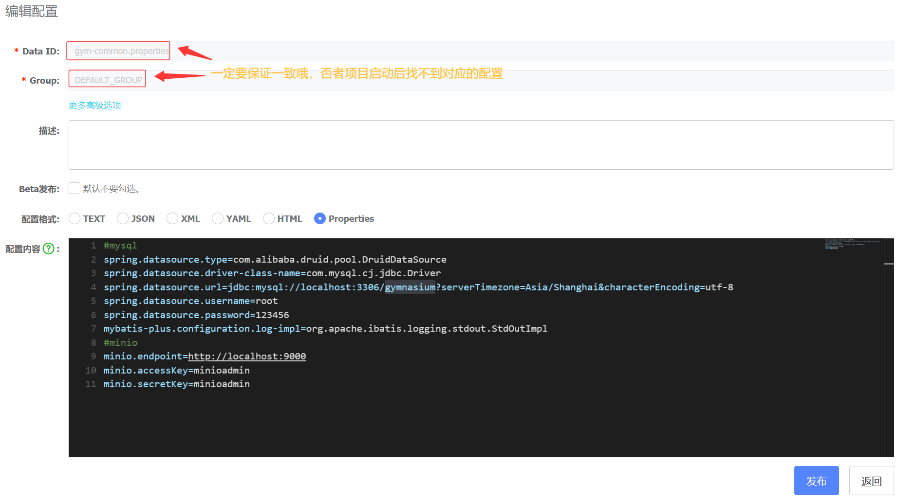
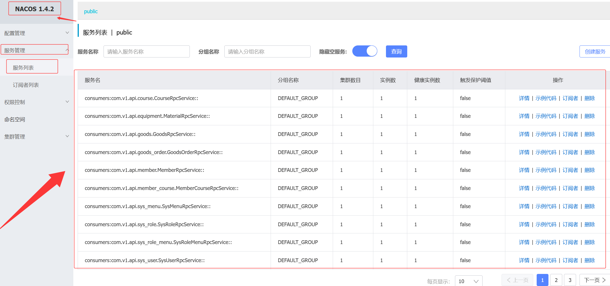
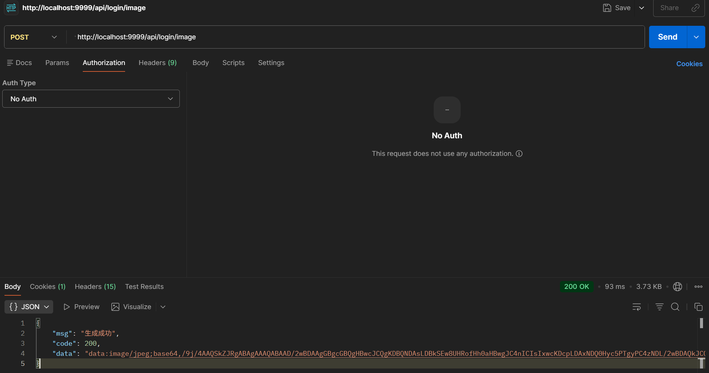

# 🏋️ 帕梅拉酷我健身-在线管理系统

基于 Spring Boot + Dubbo 分布式架构的健身房管理系统后端，提供会员管理、课程管理、商品订单、器材管理、权限控制等核心功能。


---

## 📖 项目介绍

本项目从 Spring Boot 单体架构演进为 **Dubbo + Nacos 微服务分布式架构**，实现了服务拆分、远程调用、配置中心统一管理。系统面向健身房日常运营场景，支持管理员（员工）、教练、会员三种角色，涵盖用户认证、权限管理、会员办卡充值、课程报名、商品下单、器材管理、失物招领、意见反馈等完整业务流程。

### 项目结构

```
gym-parent-project
├── gym-common              # 公共模块（工具类、状态码、Nacos 配置加载器）
├── gym-api                 # RPC 接口 & DTO 定义（20 个接口 + 24 个 DTO）
├── gym-service-user        # 用户/角色/菜单/登录服务（:8081, Dubbo :20881）
├── gym-service-member      # 会员/会员卡/充值/办卡服务（:8082, Dubbo :20882）
├── gym-service-course      # 课程/选课服务（:8083, Dubbo :20883）
├── gym-service-goods       # 商品/订单/器材服务（:8084, Dubbo :20884）
├── gym-service-home        # 首页统计/建议/失物服务（:8085, Dubbo :20885）
├── gym-service-web         # BFF 网关层（:9999, Dubbo Consumer :20880）
├── scripts                 # Nacos 配置上传脚本 & 数据库初始化脚本
└── docs                    # 实施计划文档
```

---

## 🛠️ 技术栈

### 后端核心技术栈

| 技术 | 说明 | 版本 | 备注 |
|------|------|------|------|
| `Spring Boot` | Spring 快速开发脚手架 | 2.4.4 | https://spring.io/projects/spring-boot |
| `Apache Dubbo` | 分布式 RPC 框架 | 2.7.8 | https://dubbo.apache.org/zh-cn/ |
| `Alibaba Nacos` | 注册中心 & 配置中心 | 1.4.2 | https://nacos.io/zh-cn/ |
| `MyBatis-Plus` | MyBatis 增强工具 | 3.4.1 | https://baomidou.com/ |
| `MySQL` | 关系型数据库 | 8.0 | https://www.mysql.com/cn/ |
| `Druid` | 数据库连接池 | 1.2.1 | https://github.com/alibaba/druid |
| `Spring Security` | 安全认证框架 | 5.4.5 | https://spring.io/projects/spring-security |
| `java-jwt` | JSON Web Token | 3.10.3 | https://github.com/auth0/java-jwt |
| `MinIO` | 对象存储服务 | 8.3.9 | https://min.io/ |
| `Kaptcha` | 图形验证码 | 2.3.2 | https://github.com/penggle/kaptcha |
| `FastJSON` | JSON 解析工具 | 1.2.69 | https://github.com/alibaba/fastjson |
| `Swagger` | API 接口文档 | 2.9.2 | https://swagger.io/ |
| `EasyExcel` | Excel 导入导出 | 3.0.5 | https://easyexcel.opensource.alibaba.com/ |
| `Easypoi` | POI 增强工具 | 4.2.0 | https://gitee.com/lemur/easypoi |
| `Lombok` | 实体类增强工具 | 1.18.12 | https://projectlombok.org/ |
| `Commons Lang` | Java 工具类库 | 2.6 | https://commons.apache.org/proper/commons-lang/ |
| `Commons IO` | IO 工具类库 | 2.6 | https://commons.apache.org/proper/commons-io/ |

### 前端技术栈（配套项目）

| 技术 | 说明 | 版本 | 备注 |
|------|------|------|------|
| `Vue` | 前端框架 | 3.x | https://v3.vuejs.org/ |
| `Vue-Router` | 路由框架 | 4.x | https://router.vuejs.org/ |
| `Pinia` | 全局状态管理 | 2.x | https://pinia.vuejs.org/ |
| `Axios` | HTTP 中间件 | latest | https://github.com/axios/axios |
| `Element-Plus` | 前端 UI 框架 | latest | https://element-plus.org/ |
| `Vite` | 构建工具 | 5.x | https://vitejs.dev/ |
| `ECharts` | 图表框架 | latest | https://echarts.apache.org/ |
| `TypeScript` | 类型化 JavaScript | 5.x | https://www.typescriptlang.org/ |

### 开发环境

| 工具 | 说明 | 版本 | 备注 |
|------|------|------|------|
| `JDK` | Java 开发工具包 | 1.8 | https://www.injdk.cn/ |
| `Apache Maven` | 项目构建工具 | 3.9+ | https://maven.apache.org/ |
| `Git` | 版本管控工具 | latest | https://git-scm.com/ |
| `IntelliJ IDEA` | Java 开发 IDE | 2022+ | https://www.jetbrains.com/idea/ |
| `Navicat` | 数据库管理工具 | latest | https://www.navicat.com.cn/ |
| `VS Code` | 前端开发 IDE | latest | https://code.visualstudio.com/ |

---

## ✨ 核心功能

### 系统管理
- 员工 CRUD（新增/编辑/删除/密码重置）
- 角色管理 + 权限分配（树形菜单授权）
- 菜单/权限动态管理

### 会员管理
- 会员 CRUD + 会员卡类型管理
- 会员办卡（自动计算到期时间）
- 会员充值（余额管理）
- 会员角色关联

### 课程管理
- 课程 CRUD + 封面图片上传
- 会员报名选课（余额校验、重复报名检测）
- 我的课程（会员/教练双视角）
- 课程退款

### 商品 & 订单
- 商品 CRUD + 图片上传
- 商品下单（批量下单、自动计算总价）
- 器材管理
- 订单列表查询

### 首页 & 其他
- 首页统计面板（会员数/员工数/器材数/订单数）
- ECharts 热力图（热销商品/热门课程/热门会员卡）
- 失物招领（登记/认领）
- 意见反馈
- 图片验证码登录

---

## 🏗️ 系统架构

```
┌─────────────────────────────────────────────────────────┐
│                    前端 (Vue 3 + Vite)                    │
│                   localhost:8080                         │
└──────────────────────┬──────────────────────────────────┘
                       │ HTTP REST
┌──────────────────────▼──────────────────────────────────┐
│                 gym-service-web (:9999)                   │
│           BFF 网关 / Spring Security / JWT                │
│            @DubboReference (Consumer)                    │
└──────┬───────┬───────┬───────┬───────┬──────────────────┘
       │       │       │       │       │  Dubbo RPC
       ▼       ▼       ▼       ▼       ▼
┌──────┐ ┌──────┐ ┌──────┐ ┌──────┐ ┌──────┐
│ USER │ │MEMBER│ │COURSE│ │GOODS │ │ HOME │
│:8081 │ │:8082 │ │:8083 │ │:8084 │ │:8085 │
│20881 │ │20882 │ │20883 │ │20884 │ │20885 │
└──┬───┘ └──┬───┘ └──┬───┘ └──┬───┘ └──┬───┘
   │        │        │        │        │
   └────────┴────────┴────────┴────────┘
                    │ MySQL
            ┌───────▼───────┐
            │   Nacos :8848  │
            │ 注册 + 配置中心  │
            └───────────────┘
            ┌───────▼───────┐
            │  MinIO :9000   │
            │   对象存储       │
            └───────────────┘
```

### 跨服务 Dubbo 调用矩阵

| Consumer | → Provider | 调用接口 |
|----------|-----------|---------|
| gym-service-web | gym-service-user | SysUser / SysRole / SysMenu / Login |
| gym-service-web | gym-service-member | Member / MemberCard / MemberRecharge |
| gym-service-web | gym-service-course | Course / MemberCourse |
| gym-service-web | gym-service-goods | Goods / GoodsOrder / Material |
| gym-service-web | gym-service-home | Home / Suggest / Lost |
| gym-service-course | gym-service-member | MemberRpcService（余额查询） |
| gym-service-goods | gym-service-user | SysUserRpcService（用户查询） |

---

## 🗄️ 数据库表说明

| 表名 | 说明 | 核心字段 |
|------|------|---------|
| `sys_user` | 员工/管理员 | username, password, nick_name, is_admin |
| `sys_role` | 角色 | role_name, types(1:员工 2:会员) |
| `sys_menu` | 菜单/权限 | title, path, component, type(0目录/1菜单/2按钮) |
| `sys_role_menu` | 角色-权限关联 | role_id, menu_id |
| `sys_user_role` | 员工-角色关联 | user_id, role_id |
| `member` | 会员 | name, username, password, money, card_type, end_time |
| `member_card` | 会员卡类型 | title, card_type, price, card_day |
| `member_apply` | 办卡记录 | member_id, card_type, card_day, price |
| `member_recharge` | 充值记录 | member_id, money, create_time |
| `member_role` | 会员-角色关联 | member_id, role_id |
| `member_course` | 会员选课 | member_id, course_id, course_name, status |
| `course` | 课程 | course_name, teacher_name, course_price, course_hour |
| `goods` | 商品 | name, price, store, image |
| `goods_order` | 订单 | goods_id, num, total_price, control_user |
| `material` | 器材 | name, num_total, details |
| `lost` | 失物招领 | lost_name, status(0未认领/1已认领) |
| `suggest` | 意见反馈 | title, content, date_time |

---

## 🚀 启动方式

### 前置条件
- JDK 1.8+
- MySQL 8.0（执行 `scripts/gym.sql` 一键建库建表）
- MinIO（图片存储，可选）
- Nacos 1.4.2

### 1. 初始化数据库

```bash
mysql -u root -p < scripts/gym.sql
```

### 2. 启动 Nacos

```bash
cd D:\softs\Nacos\nacos1.4.2\nacos
startup.cmd -m standalone
```

### 3. 上传 Nacos 配置（仅首次）

```bash
scripts\upload-nacos-configs.bat
```

或者手动在 `http://127.0.0.1:8848/nacos` → 配置管理 → 配置列表，新建 `gym-common.properties`（group: `DEFAULT_GROUP`, type: `properties`）：

```properties
spring.datasource.type=com.alibaba.druid.pool.DruidDataSource
spring.datasource.driver-class-name=com.mysql.cj.jdbc.Driver
spring.datasource.url=jdbc:mysql://localhost:3306/gymnasium?serverTimezone=Asia/Shanghai&characterEncoding=utf-8
spring.datasource.username=root
spring.datasource.password=123456
mybatis-plus.configuration.log-impl=org.apache.ibatis.logging.stdout.StdOutImpl
minio.endpoint=http://localhost:9000
minio.accessKey=minioadmin
minio.secretKey=minioadmin
```



### 4. 全量打包

```bash
cd gym-parent-project
mvn clean install -DskipTests
```

### 5. 启动服务（按顺序，各开终端）

```bash
# Provider 服务（使用 -exec.jar）
java -jar gym-service-user/target/gym-service-user-1.0-SNAPSHOT-exec.jar
java -jar gym-service-member/target/gym-service-member-1.0-SNAPSHOT-exec.jar
java -jar gym-service-course/target/gym-service-course-1.0-SNAPSHOT-exec.jar
java -jar gym-service-goods/target/gym-service-goods-1.0-SNAPSHOT-exec.jar
java -jar gym-service-home/target/gym-service-home-1.0-SNAPSHOT-exec.jar

# BFF 网关（标准 JAR）
java -jar gym-service-web/target/gym-service-web-1.0-SNAPSHOT.jar
```

### 6. 验证

- Nacos: `http://127.0.0.1:8848/nacos` → 服务列表应有 6 个 Dubbo 服务
- Swagger: `http://localhost:9999/swagger-ui.html`
- API: `curl http://localhost:9999/api/login/image -X POST`





---

## 🔑 测试账号

| 角色 | 用户名 | 密码 | 说明 |
|------|--------|------|------|
| 超级管理员 | `admin` | `123456` | 拥有全部权限 |
| 员工 | `zs001` | `123456` | 普通员工 |
| 教练 | `ls001` | `123456` | 教练角色 |
| 会员 | `2022001` | `123456` | 测试会员（余额 ¥4256） |

> 登录时选择对应类型（员工/会员），验证码从 gym-service-web 控制台日志 `图片验证码：` 输出获取。

---

## 🌟 项目亮点

### 1. 单体 → 分布式演进
从 Spring Boot 单体应用逐步拆分为 **6 个 Dubbo 微服务**，保留完整 Git 提交历史（40+ commits），可追溯 Phases 1-3 每一步演进过程。

### 2. Nacos 配置中心
将 `datasource`、`mybatis-plus`、`minio` 等 6 份重复配置统一管理在 Nacos 远端。通过自定义 `EnvironmentPostProcessor` 在 Bean 创建之前加载，完美避免与 Dubbo 注解处理器冲突。本地 yml 从 27 行精简至 6 行。

### 3. BFF 网关模式
`gym-service-web` 不包含任何业务逻辑，仅作为 Controller 层 + 安全网关，通过 `@DubboReference` 聚合后端 5 个微服务。

### 4. 统一白名单设计
`ignore.url` 同时控制 `CheckTokenFilter`（Token 校验）和 `SpringSecurityConfig`（权限校验），支持前缀匹配（`/**`），一次配置两处生效。

### 5. 跨服务 RPC 调用矩阵
22 个 `@DubboService` Provider + 15 个 `@DubboReference` Consumer，实现课程服务 → 会员服务的跨模块 RPC 调用。

### 6. CI/CD 友好
- `scripts/gym.sql`：一键建库建表 + 初始化数据
- `scripts/upload-nacos-configs.bat`：一键上传 Nacos 配置
- Maven 多模块统一管理，`mvn clean install` 全量构建

### 7. 完整的安全体系
Spring Security + JWT 无状态认证 + BCrypt 密码加密 + 验证码登录 + 角色权限树

---

## 🐛 遇到的问题和解决方案

### 问题 1：Spring Boot JAR 作为 Maven 依赖时类找不到

**现象：** `gym-service-web` 依赖 `gym-service-member` 编译失败，找不到 entity 类。

**原因：** Spring Boot Maven Plugin 的 `repackage` 将类打包到 `BOOT-INF/classes/`，标准 classpath 无法识别。

**解决：** 给 5 个 Provider 模块的 `spring-boot-maven-plugin` 添加 `<classifier>exec</classifier>`，产出两份 JAR：
- `xxx.jar`（标准 JAR，供依赖引用）
- `xxx-exec.jar`（可执行 JAR，运行时使用）

### 问题 2：Dubbo RPC 调用超时

**现象：** 消费者连上 Provider 但 `loadUser` 3 秒超时。

**原因：** Provider 未指定 `dubbo.protocol.host`，Dubbo 默认绑定到多网卡环境的非回环 IP（`192.168.240.1`），跨网卡通信导致延迟。

**解决：** 所有 Provider 强制配置 `dubbo.protocol.host: 127.0.0.1`。

### 问题 3：nacos-config-spring-boot-starter 与 Dubbo 冲突

**现象：** `String cannot be cast to Class` / `ProtocolConfig#0` 非法字符。

**原因：** Starter 的 `NacosPropertySourcePostProcessor` 与 Dubbo 的 `ReferenceAnnotationBeanPostProcessor` 共享 `AbstractAnnotationBeanPostProcessor` 基类，注解处理链冲突。

**解决：** 移除 starter，改用自定义 `EnvironmentPostProcessor` + `nacos-client` SDK 直连 Nacos。在 Bean 创建之前执行，完全避开 Dubbo 注解处理器。

### 问题 4：MyBatis-Plus 分页 setPages() 错误

**现象：** 用户列表分页查询返回错误结果。

**原因：** `ipage.setPages(pageParam.getCurrentPage())` —— `setPages()` 设置总页数而非当前页。

**解决：** 改为 `ipage.setCurrent(pageParam.getCurrentPage())`。

### 问题 5：MyBatis Mapper 参数注解错误

**现象：** 菜单查询 `Invalid bound statement`。

**原因：** `SysMenuMapper` 误用了 `@PathVariable`（Spring MVC 注解）而非 `@Param`（MyBatis 注解）。

**解决：** 改为 `@Param("userId") Long userId`。

### 问题 6：Controller 层 getUserType() NPE

**现象：** 大量 500 错误，`xxx.getUserType().equals("1")` 抛出 NPE。

**原因：** 前端可能不传 `userType` 参数，导致 `null.equals()`。

**解决：** 全局替换为 `"1".equals(xxx.getUserType())` 安全调用模式。

### 问题 7：前端组件路径不匹配

**现象：** 修复后端菜单路由后，前端侧边栏消失。

**原因：** `generateRoutes` 中子路由重复 `addRoute` 到顶层，导致匹配到无 Layout 包裹的路由。

**解决：** `generateRoutes` 增加 `isTopLevel` 参数，只有顶层路由才 `addRoute`。

---

## 🙏 特别鸣谢

本项目的诞生离不开开源软件和社区的支持，感谢以下开源项目及维护者 (´▽`ʃ♡ƪ)：

- [Spring](https://github.com/spring-projects) — 企业级 Java 应用框架
- [Apache Dubbo](https://github.com/apache/dubbo) — 高性能 RPC 框架
- [Alibaba Nacos](https://github.com/alibaba/nacos) — 动态服务发现与配置管理
- [MyBatis-Plus](https://github.com/baomidou) — 增强版 MyBatis ORM
- [Spring Security](https://github.com/spring-projects/spring-security) — 安全认证授权框架
- [Vue](https://github.com/vuejs) — 渐进式前端框架
- [Element Plus](https://github.com/element-plus) — Vue 3 UI 组件库
- [MinIO](https://github.com/minio) — 高性能对象存储
- [Druid](https://github.com/alibaba/druid) — 数据库连接池

特别感谢 **JetBrains** 提供的教育许可证，让本项目的开发效率大幅提升！

> 

同时也感谢其他未明确列出的开源组件的贡献与维护者。

---

## 📋 Swagger API

启动后访问：`http://localhost:9999/swagger-ui.html`

> Swagger URL 已在 `ignore.url` 白名单中，无需 Token 即可访问。

---

> Made with 💪 by 帕梅拉酷我健身开发团队 | 2024 — 2026
